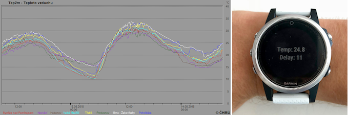

# zabiny-temp

## Summary

Check current temperature in Brno-Žabovřesky taken from [CHMI/ČHMU](http://portal.chmi.cz)

The only data that CHMI provides from the meteorological station in Brno-Žabovřesky
is a graph here: http://portal.chmi.cz/files/portal/docs/poboc/PR/grafy/br/grafy-ams-lnk.html

The goal of this project is to read the graphical representation of that image
and return the current temperature as a number. Then use the value and display it
in a Connect IQ app running on my Garmin fenix 5s watch.



There are three parts:

1. Python app

   This parses the image and returns the current temperature and
   the corresponding time read from the image. This app runs on OpenShift and returns
   the data in json format.

1. PHP app

   This runs on a webhosting. It reads the json from the OpenShift app every minute
   and saves it on the web server. It's just a simple script. The original reason
   for this middle layer was to add SSL. Apps on iOS require HTTPS for resources
   (the app on the watch gets the json through the phone), but it's impossible
   to set up HTTPS on OpenShift Online Starter. The secondary advantage is that
   caching the json speeds up the loading time on my watch (OpenShift takes 1-2
   seconds to run the python script)

1. Connect IQ app

   This is a simple app based on the WebRequest sample app included
   in the Connect IQ SDK. It loads the json from my webhosting and displays
   the temperature and delay in minutes between the time read from the image and
   current time.

## How to run the standalone python app

Clone the repo
```bash
git clone https://github.com/mmalina/zabiny-temp.git
cd zabiny-temp
```

Install virtual environment, install deps and run the script
```bash
virtualenv --python=python3 env
source env/bin/activate
pip3 install -r requirements-no-web.txt
python3 zabinytemp.py
```

## Contents

The files and directories included in this repo.

### ZabinyTemp

This is the Eclipse project for the Connect IQ app. You can easily import it into
Eclipse. See here for for more information about Connect IQ app development:
https://developer.garmin.com/connect-iq/programmers-guide/getting-started/

### requirements-no-web.txt

Python modules required for standalone usage without running a web server.

### requirements.txt

Python modules required to run the Flask app on gunicorn web server.

### wsgi.py

This is a simple gunicorn web app that OpenShift detects and runs.

### zabinytemp.py

Standalone python app that returns the current temperature read from the image
on CHMI web.

## Update 06/2020

There were breaking changes in the source image format, so I needed to update
the python script. Unfortunately I am no longer able to redeploy the new
version on the free Openshift account.

For now, I set up a local Home Assistant add-on to run the wsgi app in gunicorn.

All that's needed is to clone this repo in the `addons/` volume (e.g. mounted via the samba HA add-on), then refresh the add-ons and install the local addon. Once the add-on is running, the resulting json will be available at http://hassio.local:8000/ and this can be easily used with the rest sensor in HA (but in that case you will have to use the local hostname on the internal
network, so the url will be http://local-zabiny-temp:8000/).
